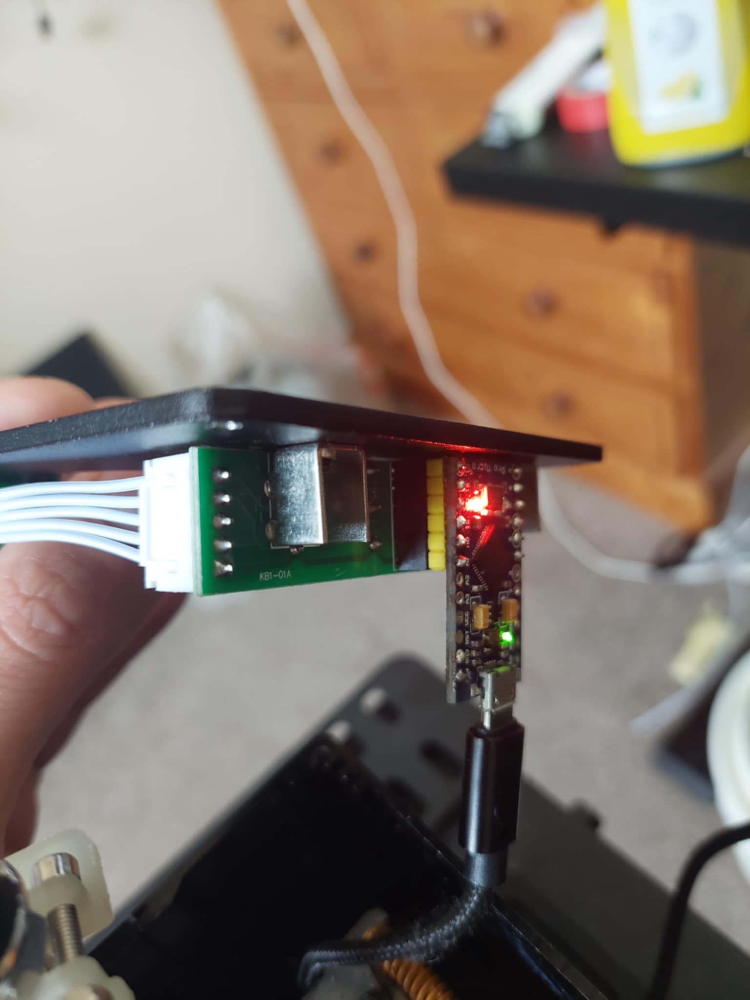
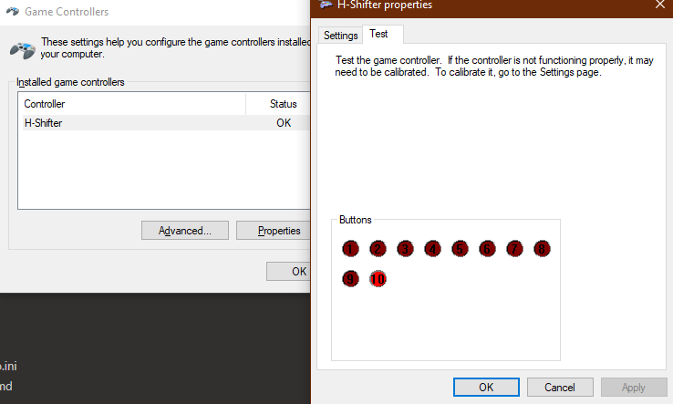
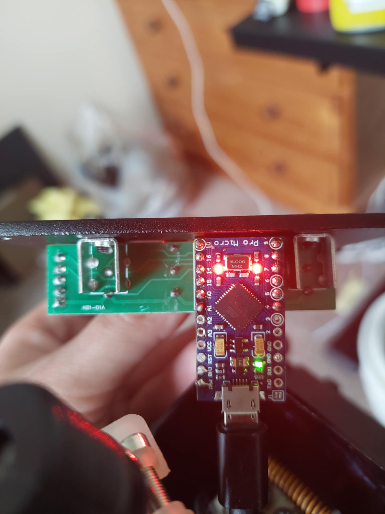

# Pro Micro mod for Aliexpress Generic H Pattern shifter

This mod replaces the microcontroller in the Shifter with a MicroUSB Arduino Pro Micro

This allows you to have:
- A dedicated USB Device Name - instead of a generic controller now it is called H-Shifter
- Toggle between Sequential and H Pattern modes, simply press both Gear 3 & 4 micro switches at the same time and the controller will start outputting Gear + and Gear - over two seperate inputs, so you can map both the H-Pattern and Sequential modes ingame without any conflicts (No more putting it in 3rd and Gear Down at the same time), to swap back just click the microswitches for Gear 3 & Gear 4 again.

You'll need platformio to build and flash this, just use the VSCode extension and `Upload`

You will need a generic 5V pro micro, micro usb preferred (as that was the original cable in my shifter), I think there are less common variants where the pins are further apart, avoid those.

You'll also need some headers 6 pin long ones for both sides

- Take apart your Shifter by undoing the for bolts in the outer most corners (remove knob and Seqential adapter too)
- Lift up and pull out the old micro controller,
- Solder on the header pins to match the photos
- Plug everything back in and flash
- Enjoy